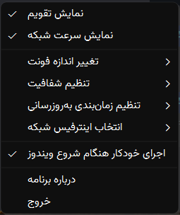
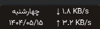

## نمایش تاریخ شمسی و سرعت شبکه روی نوار وظیفه(taskbar) در ویندوز
### Jalali Calendar & Net Speed Tray Widget for Windows

یک ویجت ساده، سبک و کاربردی برای نوار وظیفه (taskbar) ویندوز که تاریخ جلالی (شمسی) و سرعت لحظه‌ای آپلود و دانلود شبکه را
نمایش می‌دهد.

### 🖼️ تصاویر برنامه (Screenshots)

    
    

### پشتیبانی از برنامه
حمایت شما باعث تداوم این پروژه و بروزرسانی مداوم آن خواهد شد 💝
[پرداخت](https://www.coffeete.ir/nekooee)

### حمایت از طریق رمزارز
تون‌کوین (TON):

    

### ✨ ویژگی‌ها (Features)
<ul>
    <li><strong>تاریخ جلالی:</strong> نمایش کامل تاریخ شمسی، شامل روز هفته، عدد روز، ماه و سال.</li>
    <li><strong>سرعت شبکه:</strong> نمایش زنده سرعت آپلود (Up) و دانلود (Down) شبکه.</li>
    <li><strong>همیشه روی همه پنجره‌ها (Always on Top):</strong> ویجت همیشه روی سایر پنجره‌ها باقی می‌ماند تا در دسترس باشد.</li>
    <li><strong>قابلیت جابجایی (Draggable):</strong> به راحتی ویجت را با ماوس گرفته و در هر جای صفحه قرار دهید. موقعیت آن به صورت خودکار ذخیره می‌شود.</li>
    <li><strong>تنظیمات کامل:</strong> با راست‌کلیک روی ویجت به منوی تنظیمات دسترسی پیدا کنید:
        <ul>
            <li>نمایش یا مخفی کردن ویجت تقویم و شبکه.</li>
            <li>تغییر اندازه فونت.</li>
            <li>تنظیم شفافیت (Opacity) پس‌زمینه.</li>
            <li>تغییر فاصله زمانی به‌روزرسانی سرعت شبکه.</li>
            <li>انتخاب اینترفیس شبکه (وای‌فای، اترنت و...).</li>
        </ul>
    </li>
    <li><strong>اجرای خودکار:</strong> قابلیت افزودن به استارتاپ ویندوز تا با هر بار روشن شدن سیستم، برنامه به صورت خودکار اجرا شود.</li>
    <li><strong>ذخیره تنظیمات:</strong> تمام تغییرات ظاهری و موقعیت ویجت به صورت خودکار در فایل `config.txt` ذخیره می‌شود.</li>
</ul>

### 🚀 نصب و اجرا (Installation)

1. به صفحه **Releases** بروید.
2. آخرین نسخه با پسوند `.zip` را دانلود کنید.
3. برای اجرای خودکار برنامه هنگام شروع ویندوز، این گزینه را از منوی برنامه فعال کنید. برای باز کردن منو، کافی‌ست روی
   محدوده برنامه راست‌کلیک کنید.

#

## 👨‍💻 برای توسعه‌دهندگان (For Developers)

اگر قصد توسعه یا تغییر در پروژه را دارید، مراحل زیر را دنبال کنید

### پیش‌نیازها:

<ul>
    <li>Python 3.8+</li>
    <li>pip</li>
</ul>

### ریپازیتوری را کلون کنید
<pre>
git clone https://github.com/nekooee/PersianCalendarAndNetSpeed.git
cd PersianCalendarAndNetSpeed
</pre>

### نصب پکیج‌ها

<pre>pip install PyQt6 jdatetime psutil pywin32 pyinstaller</pre>

### اجرای برنامه:

<pre>python main.py</pre>

### ساخت فایل اجرایی با استفاده از فایل spec

<pre>pyinstaller main.spec</pre>

## 🤝 مشارکت (Contributing)

از مشارکت شما در این پروژه استقبال می‌شود. اگر ایده‌ای برای بهبود برنامه دارید یا با مشکلی مواجه شدید، لطفاً

یک [Issue](https://github.com/nekooee/PersianCalendarAndNetSpeed/issues) جدید ثبت کنید یا از طریق [Pull Request](https://github.com/nekooee/PersianCalendarAndNetSpeed/pulls) تغییرات خود را ارسال نمایید.

