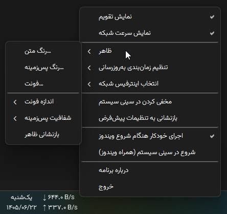

## نمایش تاریخ شمسی و سرعت شبکه روی نوار وظیفه(taskbar) در ویندوز
### Jalali Calendar & Net Speed Tray Widget for Windows

یک ویجت ساده، سبک و کاربردی برای نوار وظیفه (taskbar) ویندوز که تاریخ جلالی (شمسی) و سرعت لحظه‌ای آپلود و دانلود شبکه را
نمایش می‌دهد.

### 🖼️ تصویر برنامه (Screenshot)

    

### پشتیبانی از برنامه
حمایت شما باعث تداوم این پروژه و بروزرسانی مداوم آن خواهد شد 💝
[پرداخت](https://www.coffeete.ir/nekooee)

### حمایت از طریق رمزارز
تون‌کوین (TON):

    

### ✨ ویژگی‌ها (Features)
<ul>
    <li><strong>تاریخ جلالی:</strong> نمایش کامل تاریخ شمسی، شامل روز هفته، عدد روز، ماه و سال.</li>
    <li><strong>سرعت شبکه:</strong> نمایش زنده سرعت آپلود (Up) و دانلود (Down) شبکه.</li>
    <li><strong>همیشه روی همه پنجره‌ها (Always on Top):</strong> ویجت همیشه روی سایر پنجره‌ها باقی می‌ماند تا در دسترس باشد.</li>
    <li><strong>قابلیت جابجایی (Draggable):</strong> به راحتی ویجت را با ماوس گرفته و در هر جای صفحه قرار دهید. موقعیت آن به صورت خودکار ذخیره می‌شود.</li>
    <li><strong>سینی سیستم (System Tray):</strong>
        <ul>
            <li>مخفی کردن ویجت در سینی سیستم از منوی راست‌کلیک.</li>
            <li>نمایش تاریخ شمسی به‌صورت Tooltip با هاور روی آیکون.</li>
            <li>بازگردانی ویجت به مکان قبلی با دبل‌کلیک روی آیکون.</li>
            <li>گزینه «شروع در سینی سیستم (همراه ویندوز)» برای اجرای مخفی هنگام استارت ویندوز.</li>
        </ul>
    </li>
    <li><strong>شخصی‌سازی ظاهر:</strong> تغییر رنگ متن، رنگ پس‌زمینه، فونت، اندازه فونت و شفافیت پس‌زمینه از منوی راست‌کلیک.</li>
    <li><strong>تنظیمات کامل:</strong> با راست‌کلیک روی ویجت به منوی تنظیمات دسترسی پیدا کنید:
        <ul>
            <li>نمایش یا مخفی کردن ویجت تقویم و شبکه.</li>
            <li>مخفی کردن در سینی سیستم و بازگردانی با دبل‌کلیک روی آیکون.</li>
            <li>تغییر رنگ متن و پس‌زمینه و انتخاب فونت.</li>
            <li>تغییر اندازه فونت و شفافیت (Opacity) پس‌زمینه.</li>
            <li>تغییر فاصله زمانی به‌روزرسانی سرعت شبکه.</li>
            <li>انتخاب اینترفیس شبکه (وای‌فای، اترنت و...) با ذخیره‌سازی دائمی.</li>
            <li>بازنشانی ظاهر یا بازنشانی کامل به تنظیمات پیش‌فرض.</li>
            <li>اجرای خودکار هنگام شروع ویندوز و شروع مخفی در سینی سیستم.</li>
        </ul>
    </li>
    <li><strong>اجرای خودکار:</strong> قابلیت افزودن به استارتاپ ویندوز؛ در صورت تمایل می‌توانید برنامه را از همان ابتدا در سینی سیستم باز کنید.</li>
    <li><strong>ذخیره تنظیمات:</strong> تمام تنظیمات ظاهری، کارت شبکه، بازه به‌روزرسانی، وضعیت سینی سیستم و موقعیت ویجت در فایل <code>config.json</code> کنار برنامه ذخیره می‌شود و در اجرای بعدی باقی می‌ماند.</li>
</ul>

### 🚀 نصب و اجرا (Installation)

1. به صفحه **Releases** بروید.
2. آخرین نسخه با پسوند `.zip` را دانلود و از حالت فشرده خارج کنید.
3. فایل اجرایی را اجرا کنید؛ فایل `config.json` کنار برنامه ساخته می‌شود.
4. برای اجرای خودکار هنگام شروع ویندوز، گزینه مربوط را از منوی راست‌کلیک فعال کنید.
5. اگر می‌خواهید برنامه همراه ویندوز مستقیم در سینی سیستم باز شود، گزینه «شروع در سینی سیستم (همراه ویندوز)» را هم فعال کنید.

#

## 👨‍💻 برای توسعه‌دهندگان (For Developers)

اگر قصد توسعه یا تغییر در پروژه را دارید، مراحل زیر را دنبال کنید

### پیش‌نیازها:

<ul>
    <li>Python 3.8+</li>
    <li>pip</li>
</ul>

### ریپازیتوری را کلون کنید
<pre>
git clone https://github.com/nekooee/PersianCalendarAndNetSpeed.git
cd PersianCalendarAndNetSpeed
</pre>

### نصب پکیج‌ها

<pre>pip install PyQt6 jdatetime psutil pywin32 pyinstaller</pre>

### اجرای برنامه:

<pre>python main.py</pre>

### ساخت فایل اجرایی با استفاده از فایل spec

<pre>pyinstaller main.spec</pre>

## 🤝 مشارکت (Contributing)

از مشارکت شما در این پروژه استقبال می‌شود. اگر ایده‌ای برای بهبود برنامه دارید یا با مشکلی مواجه شدید، لطفاً

یک [Issue](https://github.com/nekooee/PersianCalendarAndNetSpeed/issues) جدید ثبت کنید یا از طریق [Pull Request](https://github.com/nekooee/PersianCalendarAndNetSpeed/pulls) تغییرات خود را ارسال نمایید.
